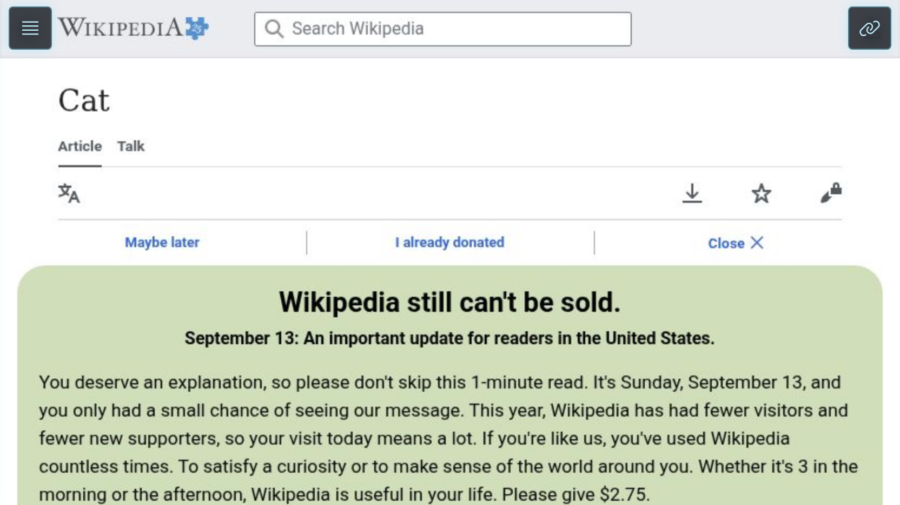
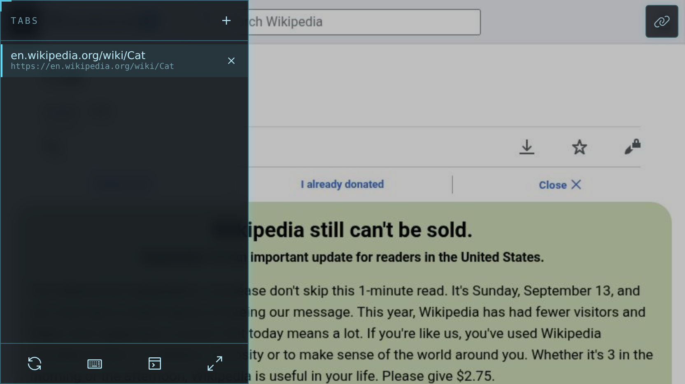
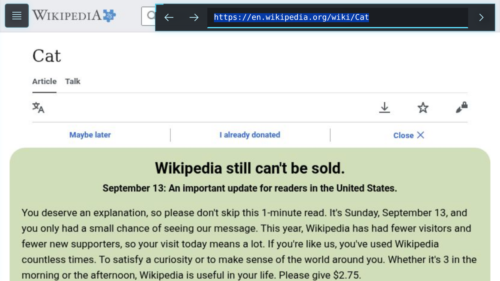
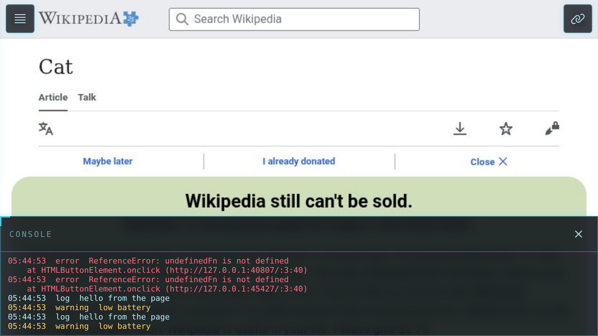

# Thor Viewer

A full-screen live view of the browser that Claude Code drives on an **AYN Thor** (dual-screen Android handheld). It runs on the top screen while Claude works in the terminal on the bottom one, so you can watch every page Claude opens, tap or type into it yourself, and see the page's console. It exists because the Thor has no desktop: there is no browser window to glance at while an agent works, so this page is that window.



## What it does

- **Shows the real browser, live.** Frames come straight from the headless Chromium that Claude controls, at the exact size and shape of your screen. Rotate the device or go full screen and the page reflows to match. No black bars, no scaling artifacts.
- **Lets you take over.** Tap, drag to scroll, and type (the keyboard button opens Android's keyboard). The built-in controller works too: left stick and D-pad scroll, right stick moves a pointer, A taps, B goes back, shoulder buttons page up and down.
- **Address bar** in the top-right corner that expands leftwards, with back and forward. Type an address or search terms.
- **Tabs drawer** in the top-left corner: switch, open, and close tabs. Closing asks for confirmation first.
- **Console panel** with the page's console output and uncaught errors, with an error badge while it is closed.
- **Installs as an app.** Chrome's *Add to Home screen* opens it with no browser UI at all; a full-screen toggle is there for the plain-browser case.

The interface uses [Carbon](https://carbondesignsystem.com/) icons and a restrained dark, high-contrast style.

| Tabs drawer | Address bar | Console |
| --- | --- | --- |
|  |  |  |

## How it works

```
top screen (Chrome)                     bottom screen (Claude Code)
┌─────────────────────┐                 ┌────────────────────────┐
│  Thor Viewer page   │ ws frames+input │  agent-browser CLI     │
│  canvas + overlays  │◄───────────────►│  (Claude's commands)   │
└──────────┬──────────┘                 └───────────┬────────────┘
           │ http /api/*                            │ CDP
┌──────────▼──────────┐                 ┌───────────▼────────────┐
│ server.mjs (:4850)  │── agent-browser ─►│ headless Chromium      │
│ static + small API  │   CLI calls     │ session "thor"         │
└─────────────────────┘                 └────────────────────────┘
```

- [`agent-browser`](https://github.com/vercel-labs/agent-browser) runs the headless Chromium and exposes a per-session **WebSocket stream** (`ws://127.0.0.1:9223/`) that sends JPEG frames whenever the page changes and accepts mouse, keyboard and touch input. The viewer page connects to it directly for the picture, taps and typing, and reads the tab list and console messages it broadcasts.
- `server.mjs` serves the page and a small API for things the stream cannot do, each backed by an agent-browser CLI call: `POST /api/viewport` (match the page to the screen), `/api/nav/{back,forward,reload,open}`, `/api/tabs` and `/api/tabs/{new,switch,close}`, `GET /api/errors` (uncaught exceptions are not on the stream), and `POST /api/input-log` (controller and key events, for mapping the Thor's buttons).
- The viewer sends its own size to `/api/viewport` on load, rotation, and full-screen changes, so the remote page takes the screen's shape. Height-only changes (Android's toolbar or keyboard) are ignored, and only the focused viewer sets the size. The server refuses size changes from headless browsers so automated tests never resize the session someone is watching.

## Requirements

This is built for one specific setup and assumes it:

- **AYN Thor** (or any Android device) with [Termux](https://termux.dev/) from F-Droid, and Termux's `chromium` package (`pkg install x11-repo chromium`).
- **agent-browser** with the Linux arm64 binary pointed at that Chromium, streaming on port 9223, session `thor`. The wrapper and config that do this live outside the repo (`~/.local/bin/agent-browser`, `~/.agent-browser/config.json`).
- **Node.js** (Termux's `nodejs`). The server has no runtime dependencies; `@carbon/icons` is a dev dependency used only to build `public/icons.svg`.
- Chrome on the same device, opening `http://127.0.0.1:4850/`. Everything is loopback-only; nothing is reachable from other machines.

Claude Code starts all of it with one script (`~/.claude/skills/agent-browser/start.sh`), which also prints the URL. By hand:

```
node server.mjs      # serves http://127.0.0.1:4850/
```

## Development

```
npm test             # end-to-end smoke test (23 checks) against the running viewer and agent-browser
npm run build:icons  # regenerate public/icons.svg after editing tools/build-icons.mjs
```

The test drives the real page in a headless Chromium and verifies taps, typing, the address bar, tabs (including confirm-to-close), the console and error capture, and the size guards through the agent-browser CLI. It navigates the shared `thor` session and restores the URL afterwards, so do not run it while someone is using the viewer. `tools/screenshots.mjs` regenerates the images in `docs/`.

Files:

- `server.mjs`: static server and API.
- `public/app.js`: stream client, drawing, input, address bar, tabs, console, controller.
- `public/app.css`, `public/index.html`: the interface. `public/icons.svg` is the Carbon sprite.
- `public/manifest.webmanifest`, `public/sw.js`, `public/icon-*.png`: installability.
- `test/smoke.mjs`, `tools/`: tests, icon build, screenshots.

## Known limitations

- Frames are JPEG images, not video; fast animation looks choppy. The stream is capped at 15 fps to save battery.
- The controller mapping is a first guess. The Thor's pad reports a non-standard layout; the viewer logs every press so the mapping can be corrected from real data.
- Everything stops when the Claude Code process ends or Android kills Termux, because the browser and servers are child processes. Restarting takes a few seconds.
- Single shared session: the viewer, Claude, and the test suite all drive the same browser.
